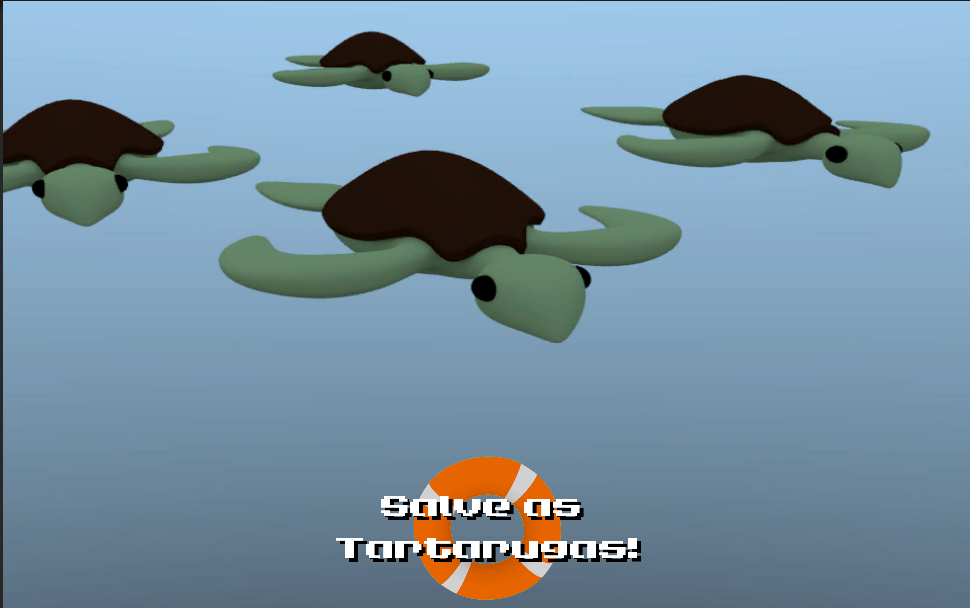

# Rio Apps 2013

## Salve as tartarugas

Projeto submetido ao evento Rio Apps 2013 na categoria games.

```
A proposta do jogo é trazer a conscientização da preservação das tartarugas marinhas, dessa forma, o 
jogador é estimulado a salvar as tartarugas recém nascidas que se perderam da direção do mar.
```


